# Spotless Co.
The Spotless Co. is a presentation website for a fictional professional cleaning company based in Stockholm, Sweden. The company's target group is private clients, who can book services via the website's booking platform. The website is also providing a contact form.

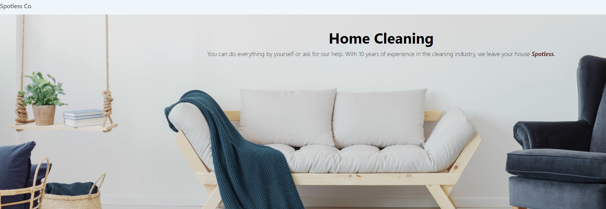

The live site can be viewed [here](https://spotlessco.herokuapp.com/).

## User Stories

As a **site user** I can **register an account** so that **I gain access to my subscription and manage upcoming events**.

As a **site user** I can **create, read, update and delete requests** so that **I can manage the wanted services**.

As a **site user** I can **receive information about my booking status** so that **I am informed in advance, and I can adjust**.

As a **site user** I can **add details to my request** so that **the requested service is provided according to my specifications**.

As a **site user** I can **have a profile associated with my account** so that **I can see and modify my details**.

As a **site user** I can **read information about the company's services** so that **I am well informed, and I can choose according to my preferences**.

As a **site user** I can **read past clients testimonials** so that **I get valuable guidance from people who have used these services**.

As a **site user** I can **contact the company** so that **I can get more helpful information or address some specific concerns**.

As a **site admin** I can **approve or disapprove client's booking requests** so that **I can do operational planning according to available resources**.

As a **site admin** I can **create, read, update and delete content** so that **I can manage my website's content**.

As a **site admin** I can **contact our clients** so that **I can inform them in case of any change**.

As a **site admin** I can **update the users' list** so that **I can add, edit and delete users**.

As a **site admin** I can **access the admin page via user interface** so that **I can manage the website**.

These user stories are part of the agile tools used for this project. In order to integrate issues and pull requests, GitHub Projects was used.

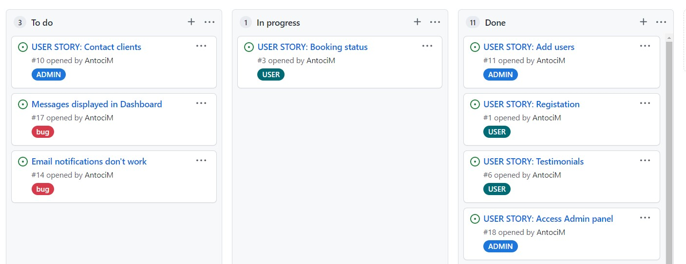

## Wireframes

- Home page 

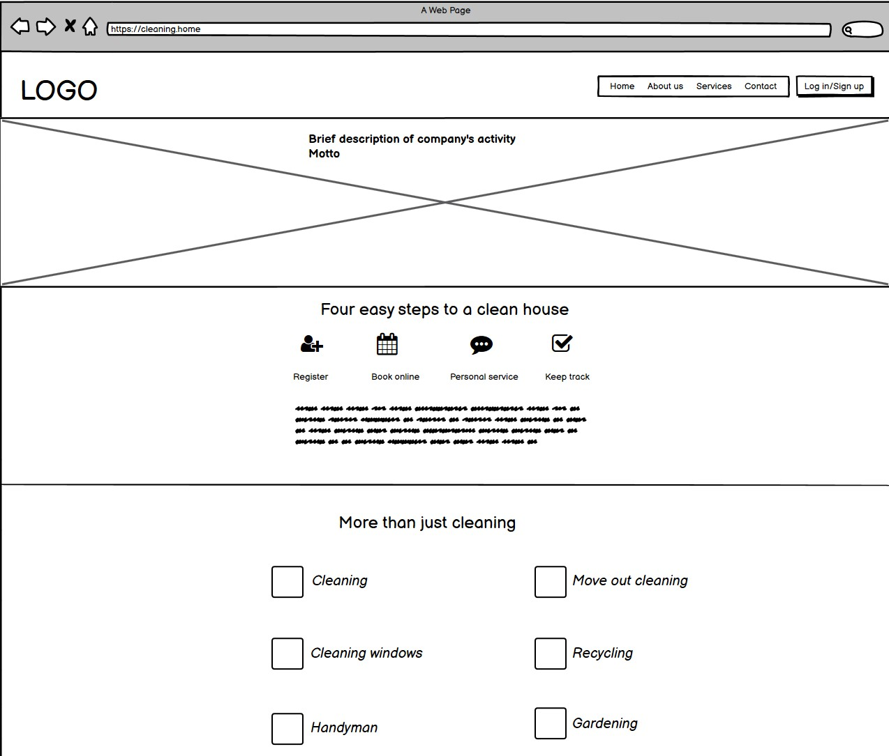

- Testimonials

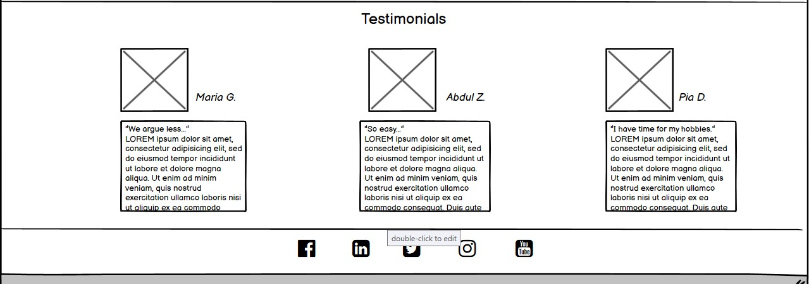

- Contact page

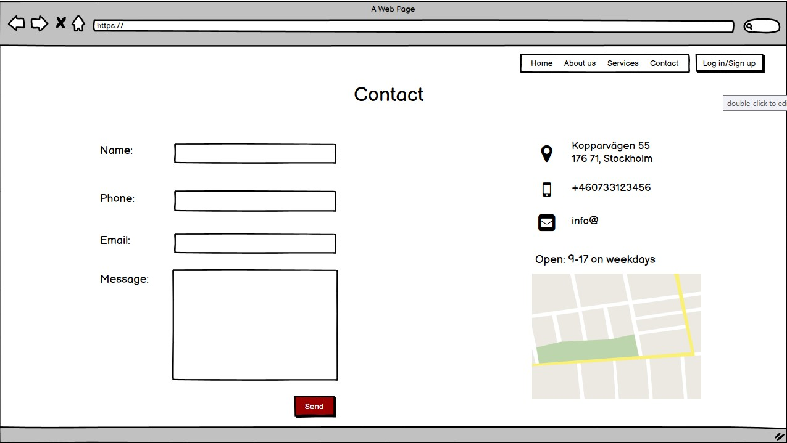

- Login form

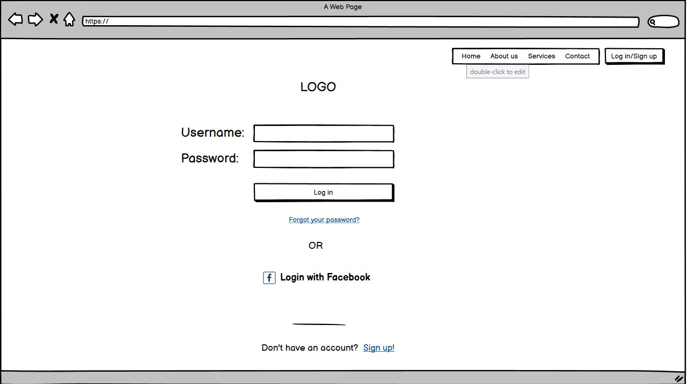

- Signup form

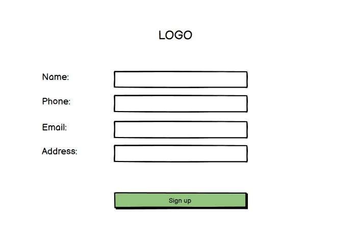

- User's dashboard

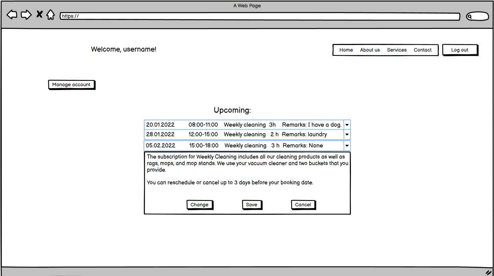

Some design changes come up during the development process. One of the changes was integrating About Us as a section on Home Page, compared to the initial design to be a separate page.
## Site Structure

The application has three main pages: Home, Services, and Contact. It also has several additional pages related to Admin, sign up, sign in and sign out.

## Design Choices

### Typhography

- The font family is 'Poppins' from Google fonts, and it is a modern, professional font and does not distract users from content.

### Color Pallet

- The primary color used has a pale tint of azure, and on the website, blue in different shadows and hues are present. Blue is associated with professional and modern aspects and gives the user a calming and familiar look.

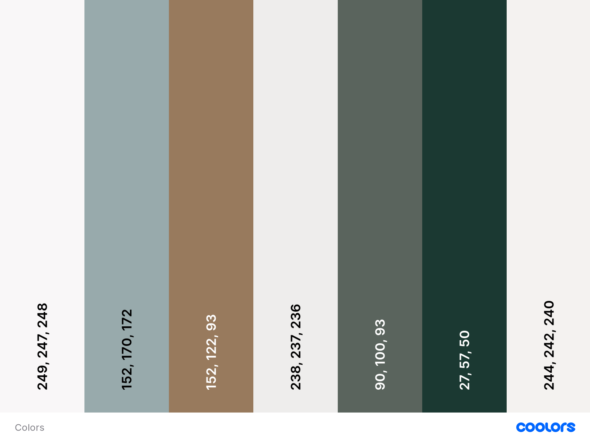

## Data Model

- Spotless website is based on MVC model (Model. View, and Controller). It consists of a database with relationships between models (represented by tables in the above image). The models are CustomUser, Booking, Service, and Contact. The views then render the models in a way dictated by the URLs.

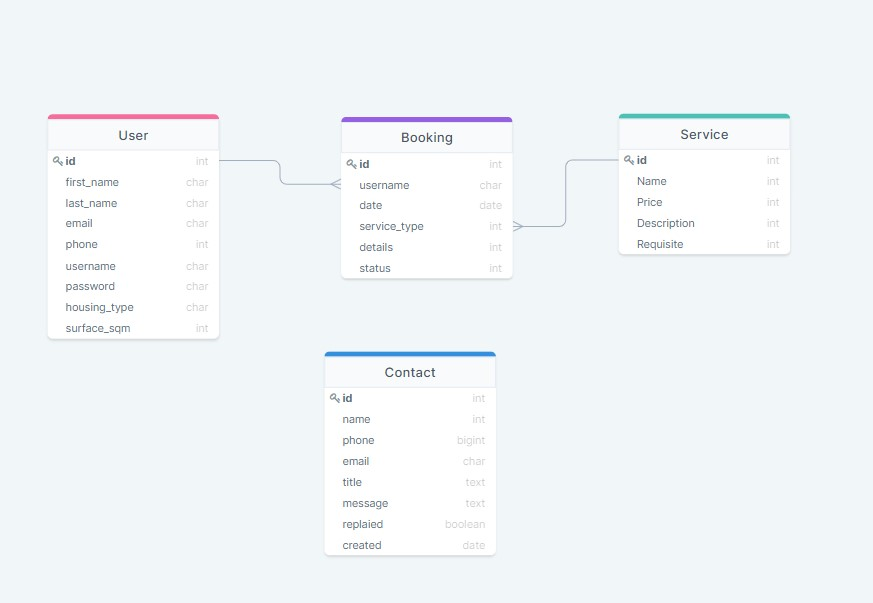

## Features

### Existing features

#### Home Page

##### Navigation bar

- It is located at the top of every page—the company's logo on the left-hand side and the menu on the other side. Navigation elements are displayed inline for displays over 750px. The Navigation Bar swifts to a dropdown list for smaller screens, represented by three lines in the top right corner.

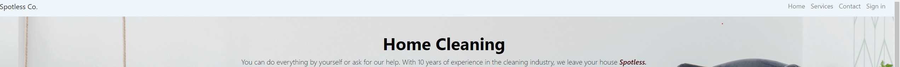

##### Main image and intro

- Located under Navigation is an image chosen to represent the tidiness of a home, with an overlayed intro text. 

##### Website interaction

- This section lets the user know how can access the wished service. 

##### Our Goal and About Us 
- Structured in 2 separated elements, these sections help the user find more information about the company's history and the values and strives that are representative.

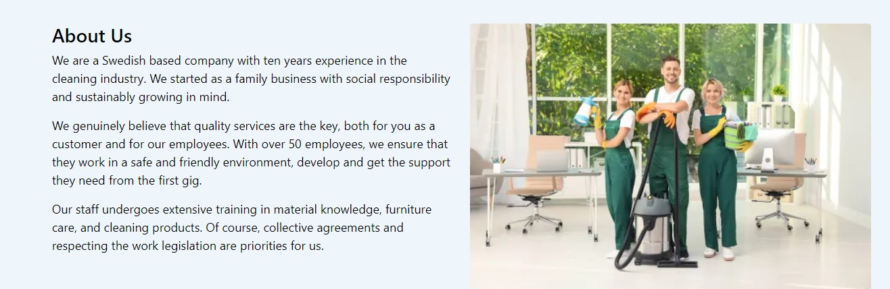

##### Service Overview
- A responsively styled services display to allow the user a quick overview. Each service has a representative icon next to it. 
- An embedded link will redirect the user to the services page.

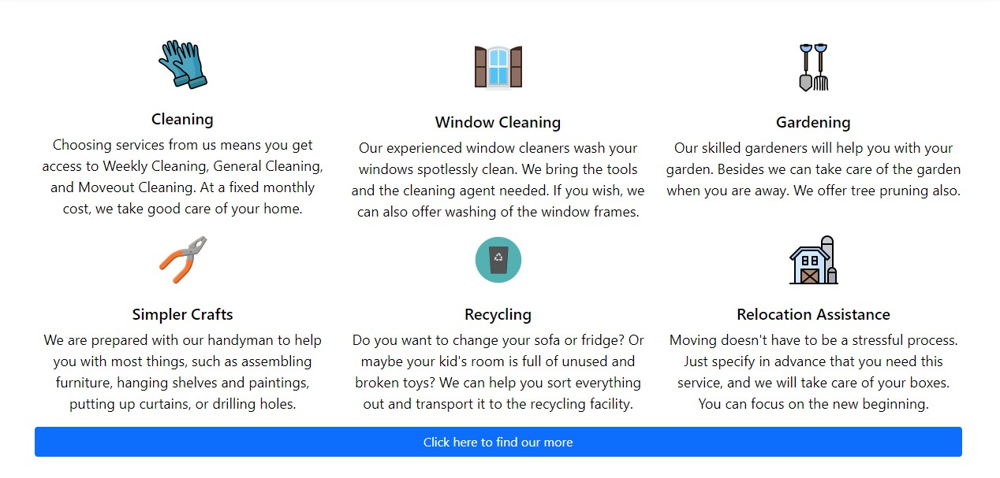

##### Testimonials

- The testimonials section provides the user with some feedback from past clients. There are three testimonials displayed, giving a picture, feedback, and name.

##### Footer

- Footer has a basic style that displays social media links and copyright information.

#### Services Page

- At the top of the page is a representative image with overlayed text providing helpful information.
- Fallows an enumeration of services. Each service has a representative icon, description, price/h, and a button redirecting the user to the booking form.

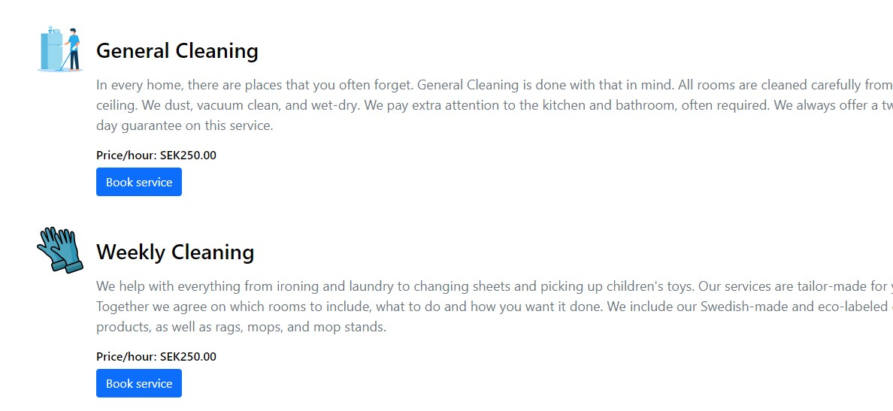

#### Contact Page

- Styled in 2 columns (contact form and contact information) in full display and for small screens, content stack on top of each other. 
- On the left-hand side is the contact form, which includes name, email, telephone, title, and message. When a user submits a contact request, the application logs the contact to the database for a record. Initially, all contacts are marked as 'unreplied'. A quick reference to see the contact's status.

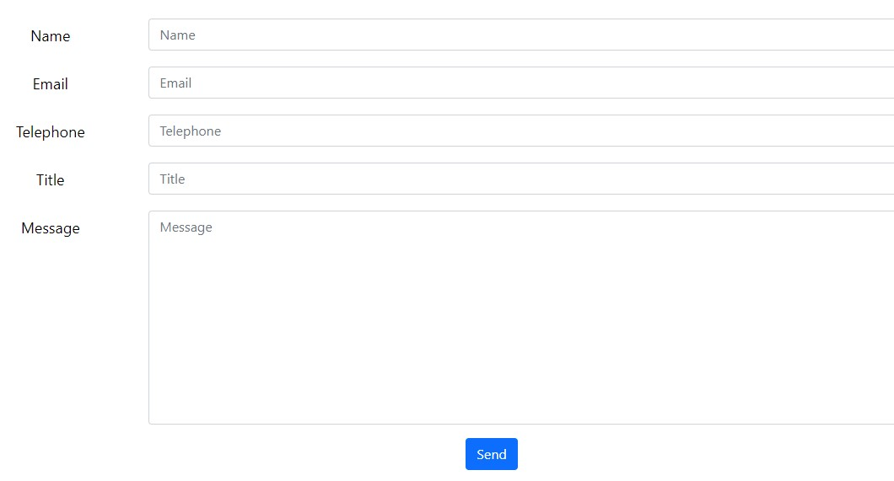

#### Sign In page

- The user can log in using his credentials, username, and password. There is a link to the signup form in the case of a new user.

- The CustomSign up form extends the Django classic form with extra fields. The user is required to add an address, city housing type (chose from a dropdown list), and house surface in sqm. This information is relevant for calculating the exact price of a service.

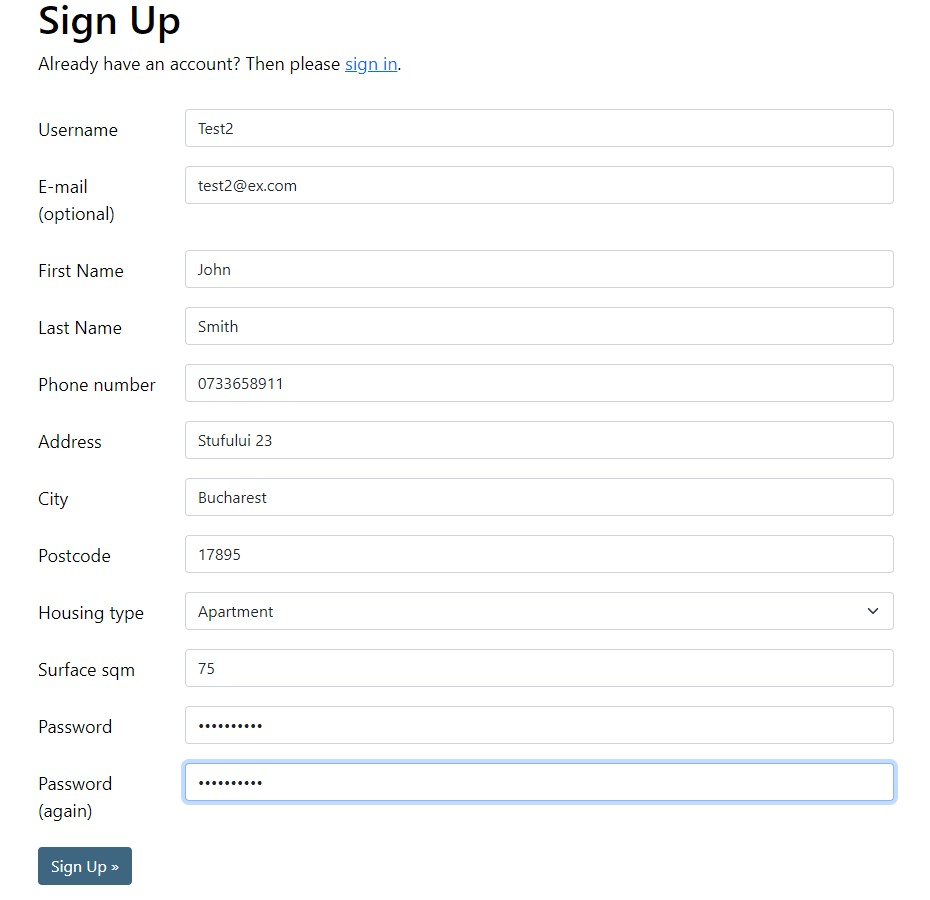

#### Additional pages 

- When the user is logged in, he can access his account using 'My Account' link from the navbar. Here the user can make a booking, see booking history and status, update or cancel one booking two days before the booked date. The user can as well update his registration information.    

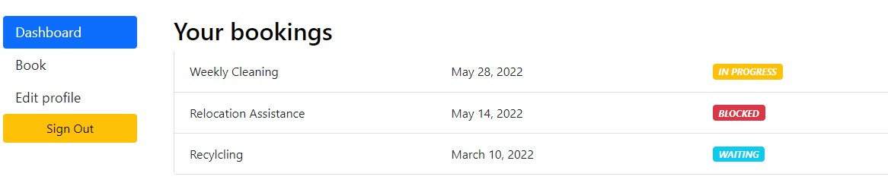

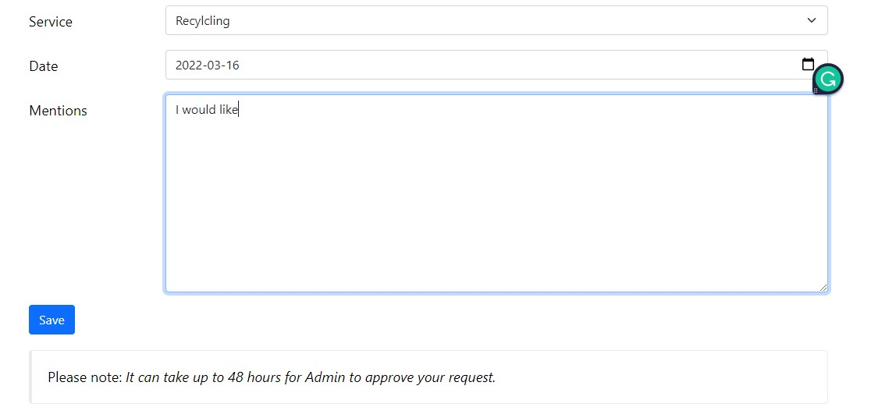

#### Admin Page

-Admin has access via the default Django Admin page. The Admin panel is accessed from the navigation menu once a superuser has logged in. Admin can add/delete users, update booking status, see the contact received via contact platform, and update the website's content

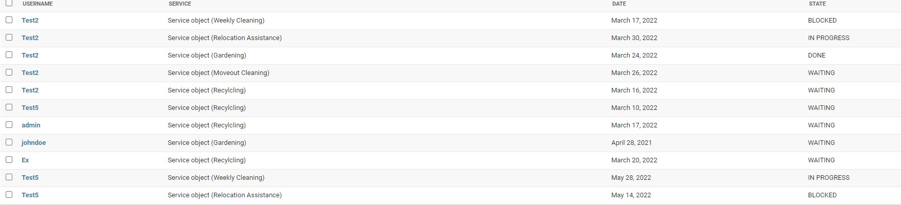

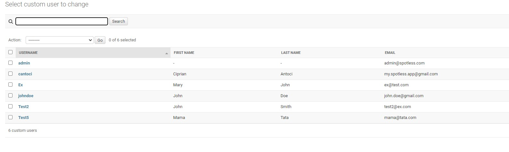

### Future Feature

- The main feature will be connecting to an email to confirm bookings and to receive email notifications with contact details.
- Automatic booking system based on specific criteria. Currently, there is a manual validation of bookings done by the Admin.
- The website would also benefit from an automatic payment system.

## Technologies used

- Python - the primary language of the application.
- HTML5 - provides the content and structure for the website.
- CSS - provides the styling.
- Django - Django framework for the project.
- Heroku - For project deployment.
- Bootstrap - Design toolkit.
- GitHub - to host the repositories.
- Gitpod - as the IDE for the application.
- Balsamiq - used to create the wireframes.
- Cloudinary - used for image storage.
- PEP8 - for testing and validating the code.
- W3C Validator - code validation.
- DrawSQL - for the database diagram.

## Credits

- [Shutterstoc](https://www.shutterstock.com/) for images.
- [Unsplash](https://unsplash.com/) for media content.
- [Coolors](https://coolors.co/palettes/trending) for genereting color scheme.
- [Iconfinder]( https://www.iconfinder.com) for the icons.
- [Theme fisher](https://themefisher.com/free-bootstrap-templates/) for inspiration on Bootstrap templates.
- [This](https://bbbootstrap.com/snippets/testimonial-box-round-images-63788768) for Testimonials.
- [Date picker](https://simpleisbetterthancomplex.com/tutorial/2019/01/03/how-to-use-date-picker-with-django.html) ideas.
- [StackOverflow](https://stackoverflow.com/) for generals ideas.
- [This tutorial](https://www.youtube.com/watch?v=fdkgcZHA0Ew&ab_channel=VeryAcademy) on data selection in Django.
- [Ordinarycoders](https://ordinarycoders.com/blog/article/build-a-django-contact-form-with-email-backend) for contact form ideas.
- [Code with Mosh](https://codewithmosh.com/p/the-ultimate-django-part1) for more info om MVC.

## Testing 

Please refer to [here](Testing.md) for more information on testing.

## Deployment

### App deployment

1. Navigate to the "Deploy" section.
2. Scroll down to "Deployment Method" and select "GitHub".
3. Authorise the connection of Heroku to GitHub.
4. Search for your GitHub repository name, and select the correct repository.
5. For Deployment, there are two options, Automatic Deployments or Manual.
6. Automatic Deployment: This will prompt Heroku to re-build your app each time you push your code to GitHub.
7. Manual Deployment: This will only prompt Heroku to build your app when you manually tell it.
8. Select "master/Main", and the deployment method that you desire.

### Fork repository on GitHub

1. Log in to GitHub and locate the repository.
2. Click on the 'Fork' button (located on the left-hand side) to create a copy of the original repository in your GitHub Account.

### Local clone of a project

1. Under the repository's name, click on the code tab.
2. In the Clone with HTTPS section, click on the clipboard icon to copy the given URL. Cloning image
3. In your IDE of choice, open Git Bash.
4. Change the current working directory to the location where you want the cloned directory to be made.
5. Type git clone, and then paste the URL copied from GitHub.
6. Press 'enter', and the local clone will be created.

## Acknowledgements

This project was completed as a 4th Project Portfolio for the Full Stack Software Developer (e-Commerce) Diploma at the Code Institute. Special thanks to my mentor Precious Ijege, for his support and feedback. 
 

