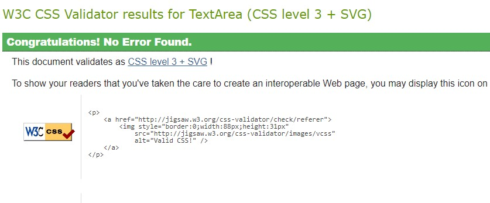
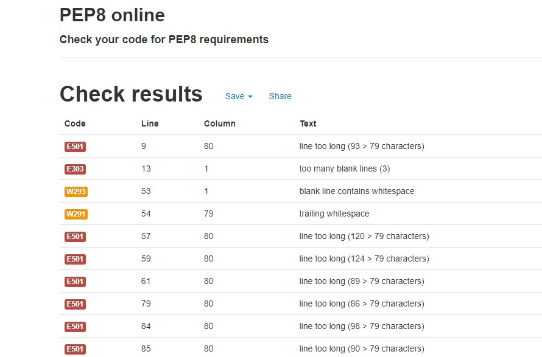
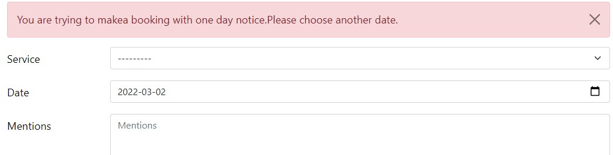

## Code verification

The Spotless Co. application has been manually tested. All the code has been run through the W3C HTML validator, the W3C CSS validator, and the PEP8 linter for python code. The code passed the W3C Validator with all the Django template tags. Outside of that, no errors were reported. 

PEP8 linter showed some errors which were fixed. 

### Lighthouse 

This tool was used to test the performance and accessibility, and it provided helpful information to improve accessibility and SEO during the creation process. Here are the final results:

This part of the testing process showed that the site was slow to load. All the images were compressed, changed the text color, added labels. This sped up the loading time and increased the performance rating.

### Manual Testig

The testing targeted especially form fields input. 

- Validation was added to the **Booking date** calendar. The user cannot select a past date, same day, or the very next day. When one of these selections is made, message info is displayed. 

- User is not allowed to **cancel** his booking more than two days before the booked date, is not permitted to change service type once the booking is done, and is not allowed to edit an old booking (past current date).

- The **surface_sqm* field from the SignUp Form is not allowing the user to add negative values. This is one of the bugs documented in GitHub issues. The solution was adding MinValueValidator, and this field validates values between 20 and 500 sqm.

