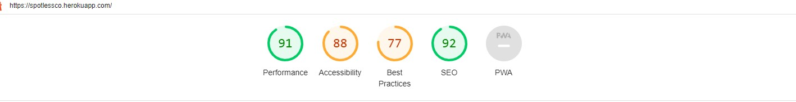

## Code verification

The Spotless Co. application has been manually tested. All the code has been run through the W3C HTML validator, the W3C CSS validator, and the PEP8 linter for python code. The code passed the W3C Validator with all the Django template tags. Outside of that, no errors were reported. 

PEP8 linter showed some errors which were fixed. 

### Lighthouse 

This tool was used to test the performance and accessibility, and it provided helpful information to improve accessibility and SEO during the creation process. Here are the final results:

This part of the testing process showed that the site was slow to load. All the images were compressed, changed the text color, added labels. This sped up the loading time and increased the performance rating.

### Responsivness

The responsive design tests were carried out manually with Google Chrome DevTools.

### Compatibility

The website was tested on Chrome, Edge, Mozilla Firefox. The functionality and appearance remain unchanged between these three on any device size.
### Manual Testing

The testing targeted especially form fields input. 

- Validation was added to the **Booking date** calendar. The user cannot select a past date, same day, or the very next day. When one of these selections is made, message info is displayed. 

- User is not allowed to **cancel** his booking more than two days before the booked date, is not permitted to change service type once the booking is done, and is not allowed to edit an old booking (past current date).

- The **surface_sqm** field from the SignUp Form is not allowing the user to add negative values, and this is one of the bugs documented in GitHub issues. The solution was adding MinValueValidator, and this field validates values between 20 and 500 sqm.

### Fixed Bugs 

During the development process, a series of errors popped up.

- ConnectionReffusedError (error 111) when trying to accees the SignUp. This was solved by setting validation email =’none’.

- Documented in GitHub issues are other fixed bugs. See: #13, #15, #16

### Known Issues

At this moment, there are two open bugs on GitHub issues. The display of multiple messages in the dashboard and the email notification are not working
#14 and #17

